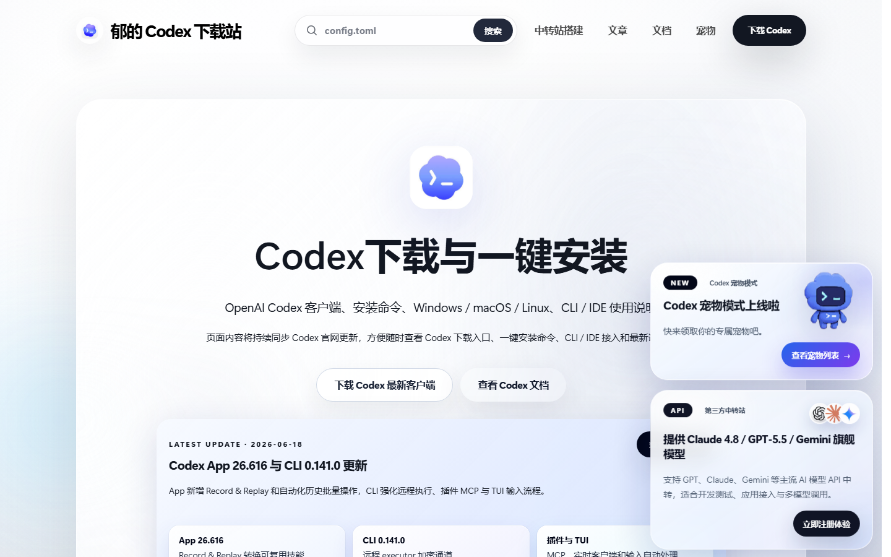

# Codex 下载指南 | Codex Download Guide

[](https://github.com/byQxo/codex-download-guide)
[](https://www.docker.com/)
[](https://nodejs.org/)
[](https://playwright.dev/)
[](./LICENSE)

中文 | [English](#codex-download-guide)

## 项目简介

这是一个社区维护的 Codex 下载与中文文档页面镜像项目，面向需要在本地或自有服务器部署静态下载站的开发者。

- 在线演示：[download.yudidc.cc](https://download.yudidc.cc/)
- GitHub：[byQxo/codex-download-guide](https://github.com/byQxo/codex-download-guide)
- API 入口：[api.yudidc.cc](https://api.yudidc.cc/)

本项目不是 OpenAI 官方仓库，也不代表 OpenAI。页面内容、第三方下载链接和素材保留各自的来源与许可。

## 功能

- 镜像 Codex 下载页、文章、更新页、平台专题和中文文档路由。
- 将镜像页面部署到 `download.yudidc.cc`，并将 API 入口替换为 `api.yudidc.cc`。
- 使用 Express 提供静态文件、clean URL 回退和 `/healthz` 健康检查。
- 保留响应式布局、FAQ 折叠、滚动动画、卡片交互和本地搜索索引。
- 提供镜像抓取、SHA-256 清单、旧域名残留检查和 Playwright 回归测试。
- 支持 Docker Compose 单机部署。

## 预览



## 目录结构

```text
public/                     # 本地页面和静态资源
server/index.mjs            # Express 静态服务
scripts/mirror-site.mjs     # 页面/资源抓取与域名改写
scripts/verify-mirror.mjs   # 镜像清单与残留域名验证
tests/e2e.spec.mjs          # Playwright 端到端测试
artifacts/                  # 清单、校验和、验证报告与回滚说明
vendor/codexdown-upstream/  # 上游开源仓库快照
Dockerfile                  # 多阶段 Docker 构建
docker-compose.yml          # 本地/服务器 Compose 配置
```

## 本地运行

要求：Node.js 20 或更高版本。

```powershell
npm install
npm run mirror
npm run build
$env:PORT = "3000"
$env:STATIC_DIR = "dist"
npm start
```

打开 <http://127.0.0.1:3000/>，健康检查地址为 <http://127.0.0.1:3000/healthz>。

开发模式：

```powershell
npm run dev
```

## 页面路由与健康检查

镜像保留目录型 clean URL，例如 `/docs/`、`/articles/`、`/updates/`、`/pets/` 及其公开子路由；Express 会将这些路径映射到对应的 `index.html`。`GET /healthz` 返回 `{"status":"ok"}`，可用于 Docker 和反向代理探活。

## Docker 部署

```powershell
docker compose -p yudidc-codex-download up -d --build
```

默认只绑定本机 `127.0.0.1:3000`，适合通过 Nginx 或 Caddy 反向代理提供公网访问。生产部署时，将 `download.yudidc.cc` 指向服务器，并由反向代理终止 TLS；`api.yudidc.cc` 保持现有 API 服务。

## 环境变量

| 变量 | 默认值 | 说明 |
| --- | --- | --- |
| `PORT` | `3000` | Express 监听端口 |
| `STATIC_DIR` | 自动选择 `dist` 或 `public` | 静态文件目录 |
| `PUBLIC_SITE_URL` | `https://download.yudidc.cc` | 公开地址和 canonical 基址 |
| `API_BASE_URL` | `https://api.yudidc.cc` | 页面中的 API/中转入口 |

可复制 `.env.example` 作为本地配置模板。

## 镜像更新与验证

```powershell
npm run mirror
npm run verify
npm run build
npm run test:e2e
```

`artifacts/mirror-manifest.json` 记录原始 URL、本地路径、HTTP 状态和 SHA-256；`artifacts/sha256sums.txt` 保存资源校验和；`artifacts/verify-report.json` 保存验证结果。

验证包括页面/资源状态、旧域名残留、助手脚本移除、品牌和 API 域名，以及核心页面、文章路由、FAQ 和响应式页面冒烟测试。

## 边界说明

- Quark、OpenAI 官方页面和其他第三方下载链接仍然跳转到原始外部地址。
- `api.yudidc.cc` 是外部 API 服务，本项目不包含其服务端实现或密钥。
- 原站动态助手已从镜像页面移除，本项目不提供模型聊天后端。
- 镜像页面内容和媒体可能受原始来源的版权或使用条款约束；代码许可证不自动覆盖这些素材。

## 上游与贡献

项目使用 [`codex-down/codexdown.cc`](https://github.com/codex-down/codexdown.cc) 作为初始静态站骨架，并在 `vendor/codexdown-upstream/` 保留快照。欢迎提交 Issue 和 Pull Request；提交前请运行 `npm run verify`、`npm run build` 和 `npm run test:e2e`。

## 许可证

项目代码使用 [Apache License 2.0](./LICENSE)。镜像页面内容、品牌、图片、视频和外部链接不当然包含在该代码许可证中。

---

<a id="codex-download-guide"></a>

# Codex Download Guide

[](https://github.com/byQxo/codex-download-guide)
[](https://www.docker.com/)
[](https://nodejs.org/)
[](https://playwright.dev/)
[](./LICENSE)

## Overview

This is a community-maintained mirror of Codex download and Chinese documentation pages for developers who want to run the static site locally or on their own server.

- Live site: [download.yudidc.cc](https://download.yudidc.cc/)
- GitHub: [byQxo/codex-download-guide](https://github.com/byQxo/codex-download-guide)
- API endpoint: [api.yudidc.cc](https://api.yudidc.cc/)

This is not an official OpenAI repository and does not represent OpenAI. Page content, third-party download links, and media keep their original ownership and licensing terms.

## Features

- Mirrors Codex download pages, articles, updates, platform guides, and Chinese documentation routes.
- Rewrites the public site to `download.yudidc.cc` and API entry points to `api.yudidc.cc`.
- Uses Express for static files, clean URL fallback, and the `/healthz` health endpoint.
- Preserves responsive layout, FAQ disclosure, scroll animations, card interactions, and the local search index.
- Provides mirror manifests, SHA-256 checksums, stale-domain checks, and Playwright regression tests.
- Supports single-host Docker Compose deployment.

## Preview


## Repository layout

```text
public/                     # Mirrored pages and static assets
server/index.mjs            # Express static server
scripts/mirror-site.mjs     # Fetching and URL rewriting
scripts/verify-mirror.mjs   # Mirror and stale-domain verification
tests/e2e.spec.mjs          # Playwright end-to-end tests
artifacts/                  # Manifests, checksums, reports, and rollback notes
vendor/codexdown-upstream/  # Upstream repository snapshot
Dockerfile                  # Multi-stage Docker build
docker-compose.yml          # Local/server Compose configuration
```

## Local development

Requirements: Node.js 20 or newer.

```powershell
npm install
npm run mirror
npm run build
$env:PORT = "3000"
$env:STATIC_DIR = "dist"
npm start
```

Open <http://127.0.0.1:3000/>. The health endpoint is <http://127.0.0.1:3000/healthz>.

## Docker deployment

```powershell
docker compose -p yudidc-codex-download up -d --build
```

The default mapping binds to `127.0.0.1:3000`, intended for an Nginx or Caddy reverse proxy. Point `download.yudidc.cc` to the server, terminate TLS at the proxy, and keep `api.yudidc.cc` pointed at the existing API service.

## Configuration and updates

| Variable | Default | Description |
| --- | --- | --- |
| `PORT` | `3000` | Express listen port |
| `STATIC_DIR` | Auto-selects `dist` or `public` | Directory served as static files |
| `PUBLIC_SITE_URL` | `https://download.yudidc.cc` | Public URL and canonical base |
| `API_BASE_URL` | `https://api.yudidc.cc` | API/relay base used in pages |

Development mode:

```powershell
npm run dev
```

## Routes and health check

The mirror keeps directory-style clean URLs such as `/docs/`, `/articles/`, `/updates/`, `/pets/`, and their public subroutes. Express maps these paths to the matching `index.html`. `GET /healthz` returns `{"status":"ok"}` for Docker and reverse-proxy probes.

To update and verify the mirror, run each command in order:

```powershell
npm run mirror
npm run verify
npm run build
npm run test:e2e
```

## Boundaries and attribution

Third-party download links keep their original destinations. `api.yudidc.cc` is external and its implementation/secrets are not included. The original dynamic advisor is removed. Page content and media may have terms from their original sources and are not automatically covered by the code license.

The initial static skeleton comes from [`codex-down/codexdown.cc`](https://github.com/codex-down/codexdown.cc), with a snapshot stored in `vendor/codexdown-upstream/`.

## DNS, reverse proxy, and HTTPS

Point the `download.yudidc.cc` DNS record to the deployment host. Bind the container to loopback, proxy it with Nginx or Caddy, and terminate TLS at the proxy. Keep `api.yudidc.cc` pointed at the existing API service.

## Contributing

Issues and pull requests are welcome. Run `npm run verify`, `npm run build`, and `npm run test:e2e` before submitting changes.

## License

Project code is licensed under the [Apache License 2.0](./LICENSE). Mirrored content, brands, images, videos, and external links are not automatically covered by that code license.
